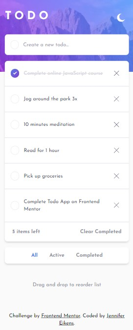

# Frontend Mentor - Todo app solution

This is a solution to the [Todo app challenge on Frontend Mentor](https://www.frontendmentor.io/challenges/todo-app-Su1_KokOW). Frontend Mentor challenges help you improve your coding skills by building realistic projects.

## Table of contents

- [Overview](#overview)
  - [The challenge](#the-challenge)
  - [Screenshot](#screenshot)
  - [Links](#links)
- [My process](#my-process)
  - [Built with](#built-with)
  - [What I learned](#what-i-learned)
  - [Useful resources](#useful-resources)
- [Author](#author)

## Overview

### The challenge

Users should be able to:

- View the optimal layout for the app depending on their device's screen size
- See hover states for all interactive elements on the page
- Add new todos to the list
- Mark todos as complete
- Delete todos from the list
- Filter by all/active/complete todos
- Clear all completed todos
- Toggle light and dark mode
- **Bonus**: Drag and drop to reorder items on the list

### Screenshot





### Links

- Solution URL: [Github repository](https://github.com/Jenny-Eikens/todo-app)
- Live Site URL: [Live site](https://todo-app-gray-nine-49.vercel.app/)

## My process

### Built with

- Semantic HTML5 markup
- CSS custom properties
- Typescript
- Flexbox
- Mobile-first workflow
- [React](https://reactjs.org/) - JS library
- [Next.js](https://nextjs.org/) - React framework
- [TailwindCSS](https://tailwindcss.com/) - CSS framework

### What I learned

I initially struggled with the hover effect on the border of the checkboxes. I tried using border-image, which didn't work because it wasn't compatible with border-radius, so I would've only been able to render squares. The solution I found sets two linear gradients (the first one just being the regular background color of the element) and makes use of padding-box and border-box:

```css
.todo-checkbox:hover {
  border: 1px solid transparent;
  background:
    linear-gradient(white, white) padding-box,
    linear-gradient(to bottom right, #567de6, #823cd0) border-box;
  transition: all 150ms;
}
```

I also implemented drag-and-drop for the first time. After some research, I decided to use a library (dnd-kit) for simplicity's sake. Here, I initially ran into the problem of no longer being able to access the checkbox and delete buttons because clicking them was being interpreted as the start of a drag event. I fixed this by only registering the listeners on the actual label rather than the div containing everything.

## Author

- Website - [Jennifer Eikens](https://jenny-eikens.github.io/portfolio-page/#projects)
- Frontend Mentor - [@Jenny-Eikens](https://www.frontendmentor.io/profile/Jenny-Eikens)
- GitHub - [Jenny-Eikens](https://github.com/Jenny-Eikens)
